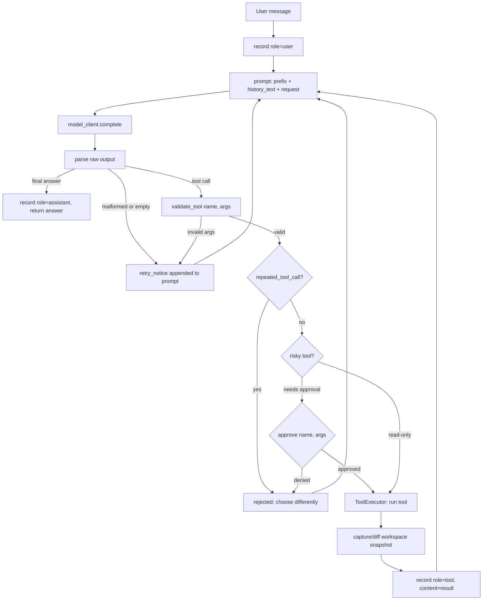
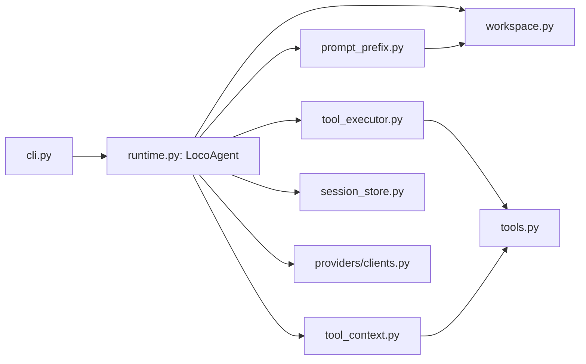

# LocoAgent

A small local coding agent, built from scratch in deliberate phases: a model that can read a repository, decide to call a tool, act on the filesystem/shell, and keep going until it has an answer.

This repo is also a build log — `docs/Implementation_order.md` is the design doc that drives the order everything gets written in, phase by phase, so each piece is testable in isolation before the next one leans on it.

## Overview

LocoAgent is a `LocoAgent` runtime object that turns a user request into:

1. a **prompt** — identity + rules + tool specs + a workspace snapshot + conversation history
2. a **model call** — any client that implements `.complete(prompt, max_new_tokens)`
3. a **parsed decision** — the model answered (`<final>`), asked to call a tool (`<tool>`), or returned something malformed
4. an **action** — a tool runs under a guardrail layer (path confinement, arg validation, approval, repeated-call detection, step limits) before anything touches disk or a shell
5. a **loop** — tool results get folded back into history and the model is asked again, until it returns a final answer or a budget runs out

## How the agent loop works



Everything in that diagram lives in `runtime.py` (`LocoAgent.ask/parse/prompt`), with `tool_executor.py` owning the validate → guard → run → snapshot-diff sequence and `tools.py` owning the actual tool implementations.

## Module layout



| Module | Responsibility |
|---|---|
| `workspace.py` | Snapshots cwd/repo/branch/git-status/recent commits into prompt text + a fingerprint for change detection |
| `session_store.py` | Persists a session (history, id, metadata) to JSON on disk |
| `providers/clients.py` | Model clients — `FakeModelClient` (scripted, for tests) and `OpenAICompatibleModelClient` (real) |
| `prompt_prefix.py` | Builds the identity/rules/tool-spec/workspace block that opens every prompt |
| `tool_context.py` | The narrow, injectable surface (`path()`, `shell_env()`) tool functions get instead of the whole agent |
| `tools.py` | The 6 tool implementations + their schemas, examples, and arg validation |
| `tool_executor.py` | Guardrail pipeline around a tool call: allowlist → validate → repeat-check → approval → run → snapshot diff |
| `runtime.py` | `LocoAgent` — prompt building, parsing (`<final>`/JSON-`<tool>`/XML-`<tool>`), the `ask()` control loop, tool dispatch |

## Tools

| Tool | Risky? | Call shape |
|---|---|---|
| `list_files` | no | `<tool>{"name":"list_files","args":{"path":"."}}</tool>` |
| `read_file` | no | `<tool>{"name":"read_file","args":{"path":"README.md","start":1,"end":80}}</tool>` |
| `search` | no | `<tool>{"name":"search","args":{"pattern":"binary_search","path":"."}}</tool>` |
| `run_shell` | **yes** | `<tool>{"name":"run_shell","args":{"command":"pytest -q","timeout":20}}</tool>` |
| `write_file` | **yes** | `<tool name="write_file" path="f.py"><content>...</content></tool>` |
| `patch_file` | **yes** | `<tool name="patch_file" path="f.py"><old_text>...</old_text><new_text>...</new_text></tool>` |

Risky tools (anything that touches disk or a shell) go through an approval check and a before/after workspace snapshot diff; read-only tools skip both.

## Safety guardrails

- **Path confinement** — every tool path is resolved and checked against the workspace root; anything that escapes it is rejected before it runs.
- **Arg validation** — each tool validates its own arguments (file exists, range is sane, pattern non-empty, etc.) before execution, with a one-shot example returned on failure.
- **Repeated-call detection** — two identical consecutive tool calls get rejected instead of looping forever.
- **Approval policy** — risky tools can require interactive approval (`ask`), run unattended (`auto`), or be blocked entirely (`never`); read-only runs always deny risky tools.
- **Step/attempt caps** — the control loop bounds both total tool-call steps and consecutive malformed-output retries.

## Project status

This is being built phase by phase per `docs/Implementation_order.md`. Current state:

| Phase | What it adds | Status |
|---|---|---|
| 0 — Primitives | `workspace.py`, `session_store.py`, `FakeModelClient` | ✅ done |
| 1 — Single-turn skeleton | `prompt_prefix.py`, naive `ask()`/`parse()` | ✅ done |
| 2 — Tools | `tools.py`, `tool_context.py`, `tool_executor.py`, tool-calling loop + guardrails | ✅ done |
| 3 — Durability & observability | `task_state.py`, `run_store.py`, `agent_loop.py` extraction, trace/report | ⏳ not started |
| 4 — Working memory | `features/memory.py` (layered memory, file summaries, episodic notes) | ⏳ not started |
| 5 — Context budgeting | `context_manager.py` | ⏳ not started |
| 6 — Prefix caching | prompt-cache keying | ⏳ not started |
| 7 — Checkpoint / resume | `checkpoint.py` | ⏳ not started |
| 8 — Security / redaction | `security.py` | ⏳ not started |
| 9 — Sub-agent delegation | `tool_delegate`, depth-limited child agents | ⏳ not started |
| 10 — Durable memory | cross-task memory promotion | ⏳ not started |
| 11 — Real providers + CLI | `OpenAICompatibleModelClient` ✅, CLI wiring | 🚧 partial — `cli.py` currently talks to the model directly and doesn't drive `LocoAgent` yet |

Translation: **the agent loop itself (Phases 0-2) works end to end** — a `LocoAgent` instance can read files, search, run shell commands, and write/patch files under full guardrails. The CLI entry point, durability, memory, and resume are future work.

## Getting started

Requires Python 3.10+. The project uses [`uv`](https://docs.astral.sh/uv/) (a `uv.lock` is checked in), but plain `pip` works too.

```bash
# clone + install
git clone https://github.com/Skyltliu/LocoAgent.git
cd LocoAgent
uv sync          # or: pip install -e .

# configure a model backend
cp .env.example .env
# edit .env: LLM_OPENAI_API_BASE / LLM_OPENAI_API_KEY / LLM_OPENAI_MODEL
```

`cli.py` is still a rough work-in-progress — today it forwards your prompt straight to the model client without going through the tool loop. To actually drive the agent as it exists right now, use `LocoAgent` directly:

```python
from locoagent.runtime import LocoAgent
from locoagent.workspace import WorkspaceContext
from locoagent.session_store import SessionStore
from locoagent.providers.clients import OpenAICompatibleModelClient

workspace = WorkspaceContext.build(cwd=".")
client = OpenAICompatibleModelClient(
    model="gpt-5.4",
    base_url="https://www.rightapi.ai/codex/v1",
    api_key="...",
)
agent = LocoAgent(client, workspace, SessionStore(root=".locoagent"), approval_policy="auto")

print(agent.ask("List the files in this repo and summarize what this project does."))
```

## Running tests

```bash
uv run pytest -q
# or: pytest src/tests -q
```

## License

MIT — see [`LICENSE`](./LICENSE).
